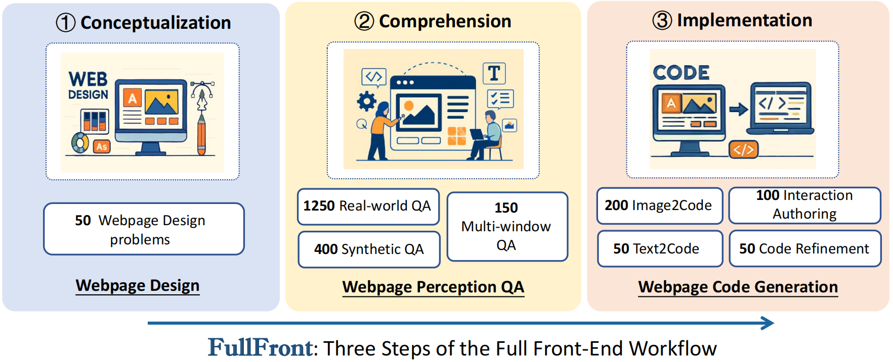
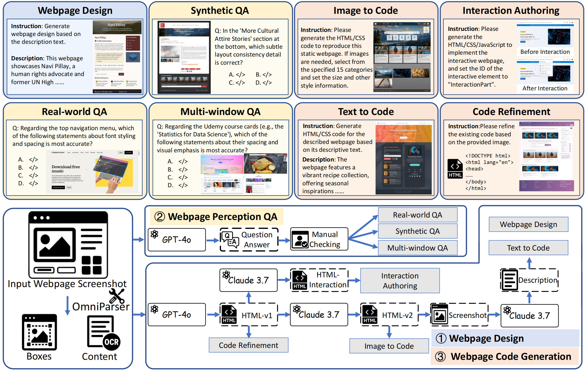

# FullFront

<div align="center">
  
</div>

FullFront is a comprehensive benchmark for evaluating Multimodal Large Language Models (MLLMs) across the entire front-end engineering workflow. This project provides code generation, page understanding, and evaluation tools to measure MLLMs' performance at various stages of front-end development.

<div align="center">
  
</div>

## Project Overview

The FullFront benchmark covers three core tasks in front-end engineering:
1. **Webpage Design** - Assessing the model's ability to organize and structure visual elements
2. **Webpage Perception QA** - Evaluating the model's understanding of visual organization, element characteristics, and spatial relationships
3. **Webpage Code Generation** - Focusing on the ability to accurately translate visual designs into functional code

## Key Features

- Supports evaluation of multiple mainstream multimodal models (Claude, OpenAI, Gemini, etc.)
- Provides a complete code generation and evaluation workflow
- Includes image similarity and code quality assessment metrics
- Automatically renders HTML into images for evaluation

## Installation

1. Clone this repository:
```bash
git clone https://github.com/your-username/FullFront.git
cd FullFront
```

2. Install dependencies:
```bash
pip install -r requirements.txt
```

## Usage Guide

### Generating Model Responses

The `generate_response` directory contains scripts for generating responses from different models:

1. **Set API Keys**: Based on the model you're using, set the API key in the corresponding script.

2. **Run Generation Scripts**:
```bash
cd generate_response
python claude_code.py  # Generate code using Claude model
python openai_code.py  # Generate code using OpenAI model
python gemini_code.py  # Generate code using Gemini model
```

3. **Use Shell Scripts for Batch Processing**:
```bash
bash run_llava_code.sh  # Run LLaVA model code generation tasks
bash run_qwen_qa.sh     # Run Qwen model QA tasks
```

The generated results will be saved in the `generate_response/results/{model_name}` directory.

### Rendering HTML to Images

Use `calculate_similarity/render_img.py` to render generated HTML into images:

```bash
python calculate_similarity/render_img.py
```

You can modify the input and output directories in this script:
```python
html_folder = "./path/to/your/html/files"
screenshot_folder = "./path/to/save/screenshots"
```

### Calculating Similarity Scores

1. **CLIP Similarity**: Evaluate semantic similarity between generated images and target images
```bash
python calculate_similarity/clip_score.py
```

2. **Code Similarity**: Evaluate structure and content similarity between generated code and standard code
```bash
python calculate_similarity/code_score.py
```

3. **Gemini Evaluation**: Use Gemini model to evaluate generated content
```bash
python calculate_similarity/gemini_evaluate.py
```

### Result Analysis

Evaluation results will be saved in the `calculate_similarity/results/` directory, containing the following metrics:
- CLIP similarity score
- Code structure similarity
- Code content similarity
- Functional implementation completeness

